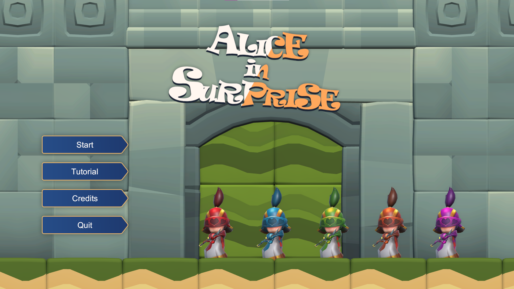
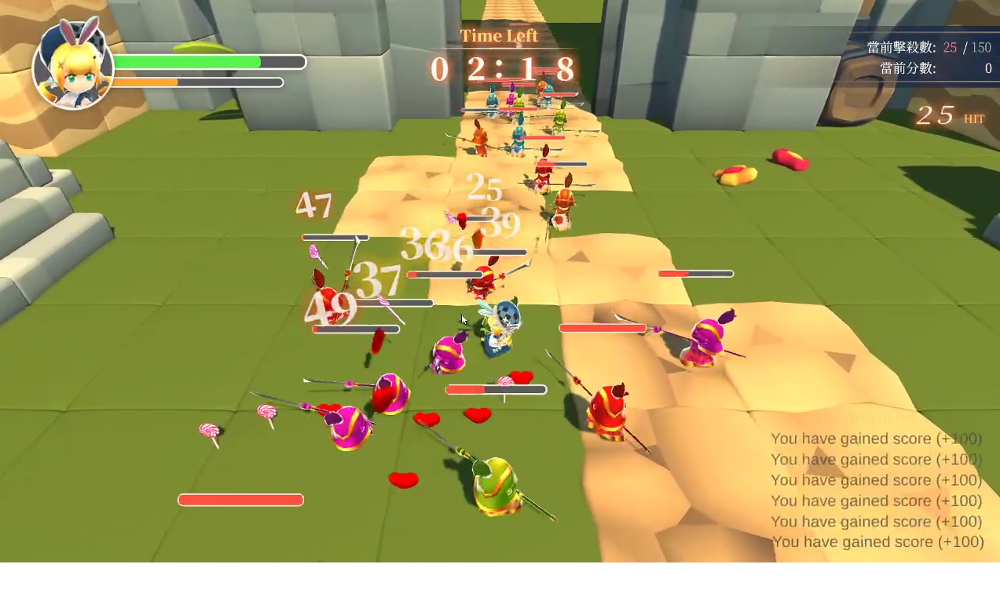
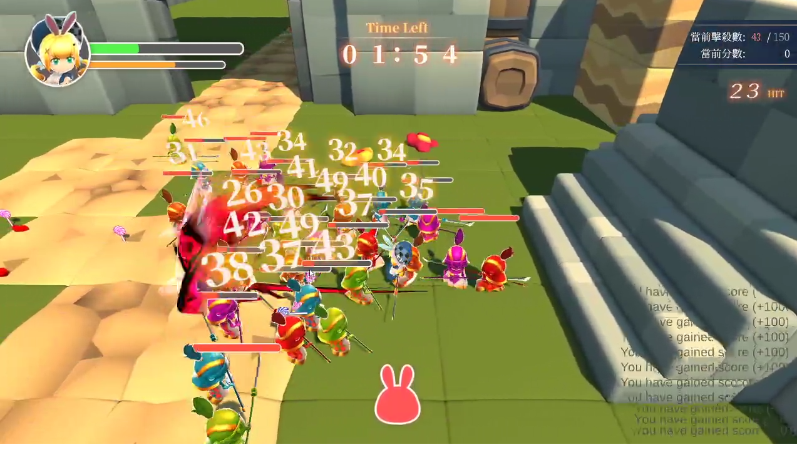

Timeline is placed in summer time, middle of July 2022, one of my friend
([@henrykuh](https://github.com/henrykuh)) invited me to join the Game
Jam that he is going to host in Aug 2022. In the meantime, he has also
invited me to rejoin the community [MatchWorkshop](https://github.com/MatchWorkshop)
, and become the headmaster of the Game Programming deparetment.
Therefore, this Game Jam is treated as an opportunity to collaborate
with other headmaster from other department in this community. 😕

I believe networking is a massive part of the Game Jam; hence I have
decided to join the event without too much hesitation. This Game Jam
came in just about the right time since I just ended another project
last month.

<!-- more -->

### ❓ About Game Jam

Game Jam's full name are [5th DIY Game Jam: Surprise](https://itch.io/jam/20220829).
This is hosted by [DIY GM](https://diygm2021.weebly.com/). Entire event
is about `1 month`, it's a lot longer compare to regular Game Jams due
to the COVID-19.

The theme is already announced through the title, `surprise`.

### 🔰 Joined! Meet the team

I was in the [MatchWorkshop]() community once a while ago, but we didn't
have time and a chance to get to know each other well. This is the right
time for me to network with other people who already have working
experience in Taiwan's Game Industry. Team and role are listed below:

- Kyrie （Game Desinger）
- Yi （3D Artist）
- 黑攻 （2D Artist、Composer）
- 特里斯卡 （2D Artist）
- Jen-Chieh Shen （Engineer）  **<- That's me! 😎**

I reckon `Yi` and `Kyrie` are two essential pieces in this group.
Without their contribution, our game will simply be a disaster.
`Yi` is responsible for making our characters (`Minions` and `Alice`)
look alive, which requires countless hours to accomplish such a heavy
task. Kyrie made a decent GDD, and shows his passion during the entire
Game Jam.

What about `Jen-Chieh` (me)? He made the entire game (programming-wise)
within `24 hours`. It could be impressive but expected. 🙂 All I want to
say is **THANK YOU** to the group!

### 💡 Design, and Programmer View

First of all, I didn't come up with the game idea. The game design had
been established before I joined the team. Therefore, I will only
talk about the game-making (engineering) part of the game. Here are
some issues that I think are worth mentioning for the record:

- GDD is incomplete, lack of details
- We don't know who came up with the idea? (even at the very end of the event)
- No core design principles, game idea could not be established

Nice reminder, this is **NOT** for me to blame on anyone in the group.
I am simply pointing it out to help myself do better in the future.
Anyways, we eventually made the game! Congratulation! 🎉🎊 Seeing
the finished game always makes me feel good! ✨

### 🖼️ Screenshots

### 💬 Conclusion

Let's move on to the conclusion; I sense this project is great compared
to many games that have been submitted to the same event. Even though
the game isn't a **complete** complete game, but it has everything a
game needs, and there are more details in the game. I am proud of myself
in this event! 👍 The only thing I have in mind so the game can be
more inclusive is that we don't have time to debug and playtest more.
I wish we could have more time or improve our time management during
the event! 🙏

### 🔗 Links

- [Game: Alice In Surprise](https://kuhhenry.itch.io/alice-in-surprise)
- [Game Jam](https://itch.io/jam/2022082)
- [DIY GM](https://diygm2021.weebly.com/)
- [MatchWorkshop](https://github.com/MatchWorkshop)
