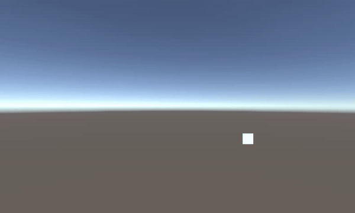
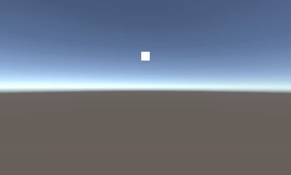
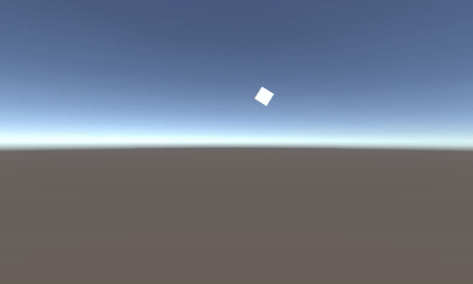
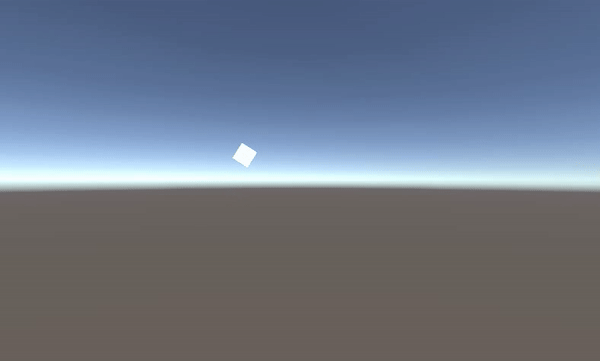
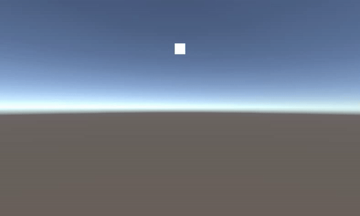

> **JCSUnity Repo:** https://github.com/jcs090218/JCSUnity

## Acknowledge

I have developed this tool for 3 years. Starting from the third year of my
college years. Compare to other framework I had developed, this tool have
much more completeness. I have been using Unity Engine for 2 years while I
decide to develop this framework. I have made cetain of games in this 2 years
and I reckon I gained enough experiences to develop a framework for Unity
Engine. In the retrospect, that was the time I have just done studying
"Data Structure", "Algorithms", "Design Patterns". What I presume that Design
Patterns are the vital part to a game development because game are often built
by multiple components or modules. What I meant multiple are refer as really a
lot of those. On the other hand, most software development would not requires
that many of the systems, generally the reasons are most of the environment
have been wrap or encapsulate by the former developers. For instances, .NET
Frameowrk, Visual BASIC/C++/C#, NetBean Graphic, etc.

<!-- more -->

On top of these concepts, this is the third framework I built. I could not
remember what I built for the previous two framworks. I presume that I have
some knowledge about building a framework, library, etc. At the beginning of
the JCSUnity development process, I have had studied the basis of the game
engine architecture but not quite fully understand the Unity Engine itself.
For instance, Unity Engine's Scripting API, and some controls specific for
Unity Eninge. Because of this, you might realized some of the code or design
are a bit fiddle and inconsistent.

When I am writing this article, the framework itself has been developed to the
state that is convoluted and hard to maintain. Within this framework, there are
around 400 to 500 scripts, most of the scripts are self executed which mean a
script is a component that could run by it own. By this idea, one Self-Runnable
Script benefits the design and increase the variation possibility but it also
brings the cost of unnecessary performance.

## Introduction

JCSUnity is a component driven framework built to allow users to quickly generate
commonly used game mechanics or features. The architecture design of JCSUnity
come alone to Unity Engine's design, which makes the framework highly compatible
with Unity Engine itself. Every time the Unity Engine release an update, there
should not be any issues to JCSUnity. This framework increases the productivity
of game developers and enhances the game development process. Base my own experiences,
the game originally that would spend my 15 weeks, I could compress development time
to around 3 to 4 weeks. JCSUnity has most of the game presets that Unity Engine does
not usually provide. For instance, switch scene with fade in and out, background music
player, automatically adjust the screen to aspect ratio, etc. With all these presets,
allow the game developers are more likely can be more focus on the design of the game
instead of worrying all these trivial features.

## Self-Runnable Script

Therefore, what is Self-Runnable Script? For example, here is a list of three SRSs.

<table>
  <tr>
    <td>1.</td>
    <td>Circle Action</td>
  </tr>
  <tr>
    <td>2.</td>
    <td>Shake Effect</td>
  </tr>
  <tr>
    <td>3.</td>
    <td>Wave Action</td>
  </tr>
</table>

Above example scripts are all self-runnable without any dependencies and 
will not influence to each other scripts. Base on this design patterns, 
how many unique behaviours if we make all these scripts interact with each other?

```
7 behaviours = 3 basic behaviours +
               (Circle Action + Shake Effect) +
               (Circle Action + Wave Action) +
               (Shake Effect + Wave Effect) +
               (Circle Action + Shake Effect + Wave Action)
```

I presume if anyone who has the necessary knowledge about game engine architecture. 
Design the components this way could avoid decoupling between the scripts, and 
added the flexibility to the designers. Designers are no longer limit to specific 
design; they can test and play with each component easily. The side effects are 
this could cost a lot of additional performance and memory usage.

<div style="text-align: center">
  
  
  
  <h4>3 Basic Actions 本身3種</h4>

  
  
  
  <h4>(Circle Action 繞圓 + Shake Effect 震動) + (Circle Action 繞圓 + Wave Action 上下搖擺) + (Shake Effect 震動 + Wave Effect 上下搖擺)</h4>

  
  <h4>(Circle Action 繞圓 + Shake Effect 震動 + Wave Action 上下搖擺)</h4>
</div>


## Scripting Design

Having the script design this way, there should be a script principle so 
people could contribute or extend to the project easier. I chose to use 
'Header' attribute to accomplish this task and here are the definition of 
all the terminology in JCSUnity.

```cs
#if UNITY_EDITOR

    [Header("** Helper Variables (JCS_ExampleScript) **")]

    /// <summary>
    /// Variable only happens in developer mode, so it won't exist in the final build. Usually the helper tool in for level designer.
    /// </summary>
    float helperVar = 0.0f;

#endif

    [Header("** Check Variables (JCS_ExampleScript) **")]

    /// <summary>
    /// Variable only for checking, do not adjust the value of the variables, but you can use to check to see the effect during runtime.
    /// </summary>
    float checkVar = 0.0f;

    [Header("** Initialize Variables (JCS_ExampleScript) **")]

    /// <summary>
    /// Variable only being use in game initialize time, set these kind of variable before hitting play button in order to get the result.
    /// </summary>
    float initVar = 0.0f;

    [Header("** Runtime Variables (JCS_ExampleScript) **")]

    /// <summary>
    /// Variable will work on both initialize time and runtime, you can adjust the variable during runtime and see the effect.
    /// </summary>
    float rtVar = 0.0f;
```

For more information, you can click [here](https://jcs090218.github.io/JCSUnity/Manual/index.html?page=Naming_sp_Manual)!

## Using 'JCS_' Filename, not Namespace

In the early version of Unity, when I try to have the same file name in the 
project, it occurs error. To address this issue, I chose to have a particular 
file name prefix in front of every file in the project, which is 'JCS_'.
