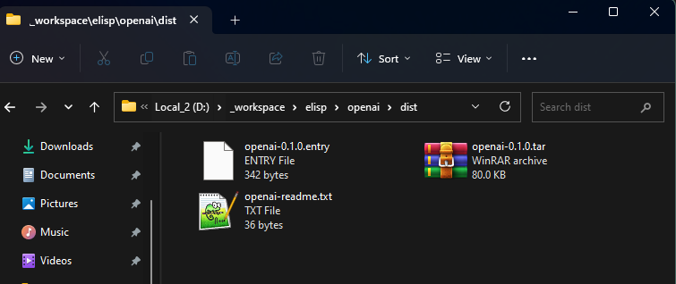
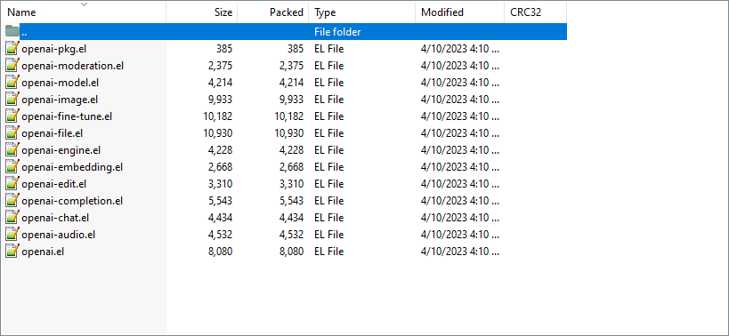
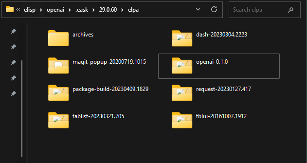

我開發了 50 多個 Emacs 插件, 並且維護了將近 100 多個. 對初學者來說, 開發
Emacs 插件是一件不容易的事情, 特別是對那些想把自己的插件發行到其他的 ELPA
的人來說更不容易. 哪些 ELPA? ([GNU Elpa][], [NonGNU Elpa][], [MELPA][], 等等.)

這是為什麼我使用 [Eask][] 來幫助我完成這些插件的開發和維護的工作. 所以我將
在這則文章教大家如何使用這個工具來幫助你完成插件的開發!

<!-- more -->

## 🗨️ 善用 `--help`

現今的 Eask 已經有超過 50 種以上的指令集 (包含隱藏的). 這個工具已經是個有
點複雜, 所以當你遇到問題的時候請善用 `--help` 這個旗幟.

```sh
$ eask --help
```

## 📦 建構插件

我們這裡直接切入正題, 我會默認你已經會初始化 Eask 專案, 並且只想知道如何
有效的使用這工具!

為了方便展示, 我直接使用了自己現存已開發完成的專案 [openal.el][openal]. 

```sh
# Clone 專案
$ git clone https://github.com/emacs-openai/openai.git

# 進入到專案裡面
cd sideline

# (非必要) 印出專案結構
tree /f
```

我們的專案結構是長這樣的:

```
│   .dir-locals.el
│   .gitignore
│   CHANGELOG.md
│   Eask
│   LICENSE.txt
│   Makefile
│   openai-audio.el
│   openai-chat.el
│   openai-completion.el
│   openai-edit.el
│   openai-embedding.el
│   openai-engine.el
│   openai-file.el
│   openai-fine-tune.el
│   openai-image.el
│   openai-model.el
│   openai-moderation.el
│   openai.el
│   README.md
│
└───.github
    └───workflows
            test.yml
```

我們用這指令來建構我們的插件:

```sh
$ eask package
```

這個指令會建立一個檔案夾 `dist`, 結果如下:



注意這個專案是個[多文件插件][multi-file package]所以建構出來的是一個 `tar`
檔案, 而不是 `.el` 檔案. 如果我們看一下這個檔案, 結果如下:



## ⚙ 安裝

現在你已經成功建構完了插件, 這代表如果你發行到任何 ELPA 都將不會有任何問
([GNU Elpa][], [MELPA][],等等.). 大家都將成功下載你的插件! 我們下一步是安裝.
如果我們可以下載你的插件, 但無法安裝, 是不是沒有任何意義? 我們使用 `install`
指令來安裝我們剛剛建立的檔案:

```sh
$ eask install
```

這個插件會安裝到一個獨立的環境, 所以我們不用擔心他會影響到我們本地的
Emacs 配置 `~/.emacs.d/`. 結果如下:



## 📋 啟動看看?

啟動一個檔案相當簡單, 正常來說我們會想要確定我們的插件是能夠被正確引入的.

```sh
$ eask test activate
```

你會看到下面的結果:

```sh
Loading package information... done v

Activating the package `openai'... succeeded v
(Nothing to load.)
```

太棒了! 這代表我們的插件已經成功被啟動了, 並且沒有任何錯誤! 😋

這個步驟通常是不必要的, 不過當你想知道你的插件是否能夠被引入, 這會相當好用!

## 👷 編譯

是時候該編譯我們的插件了! 通常情況下, 編譯步驟跟安裝步驟是相似的, 因為
安裝的過程必定有編譯. 唯一的不同在於我們不會想要每次都建構插件, 所以直接
編譯就會相通好用!

```sh
$ eask compile
```

很棒! 這次編譯也沒有任何問題! 😋

```sh
Compiling d:/_workspace/elisp/openai/openai.el... done v
Compiling d:/_workspace/elisp/openai/openai-audio.el... done v
Compiling d:/_workspace/elisp/openai/openai-chat.el... done v
Compiling d:/_workspace/elisp/openai/openai-completion.el... done v
Compiling d:/_workspace/elisp/openai/openai-edit.el... done v
Compiling d:/_workspace/elisp/openai/openai-embedding.el... done v
Compiling d:/_workspace/elisp/openai/openai-engine.el... done v
Compiling d:/_workspace/elisp/openai/openai-file.el... done v
Compiling d:/_workspace/elisp/openai/openai-fine-tune.el... done v
Compiling d:/_workspace/elisp/openai/openai-image.el... done v
Compiling d:/_workspace/elisp/openai/openai-model.el... done v
Compiling d:/_workspace/elisp/openai/openai-moderation.el... done v

(Total of 12 files compiled, 0 skipped)
```

## ⚜️ 結語

這些就是最基礎的 Eask 用法. 當然還有更多, 例如 linter 檢查代碼, 跑測試, 或者
插件管理, 等等. 不過這些等我們下一次有機會在介紹!

最後總結一下我們在這則文章使用過的指令集:

```sh
eask package        # 建構可安裝檔案
eask install        # 安裝建構檔案 (.tar 或 .el)
eask test activate  # 啟動測試
eask compile        # 編譯原始碼
```

[GNU Elpa]: https://elpa.gnu.org/
[NonGNU Elpa]: https://elpa.nongnu.org/
[MELPA]: https://melpa.org/
[Eask]: https://github.com/emacs-eask/cli
[openai]: https://github.com/emacs-openai/openai
[multi-file package]: https://www.gnu.org/software/emacs/manual/html_node/elisp/Multi_002dfile-Packages.html
